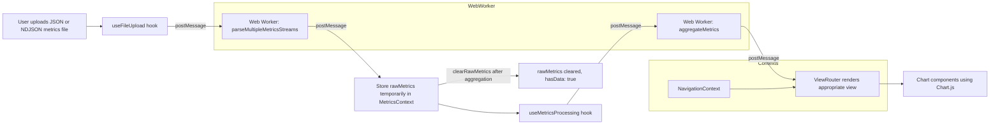
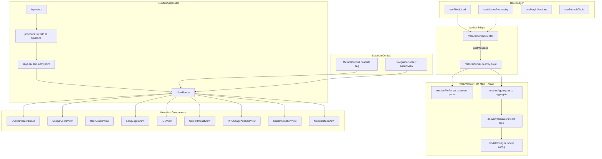

# GitHub Copilot User Level Metrics Viewer

This document explains the purpose, data format, architecture, and end-to-end data flow of the **GitHub Copilot User Level Metrics Viewer** project.

---

## 1. Purpose

The application is a **single-page analytics dashboard** for exploring **GitHub Copilot user-level metrics**. It is designed for:

- Engineering leaders and admins who receive Copilot **user-level usage exports (JSON / NDJSON)**
- Quickly understanding **adoption**, **engagement**, and **impact** of Copilot in their organization
- Exploring data by **user**, **IDE**, **language**, **feature**, and **model**
- Analyzing **Premium Request Unit (PRU)** consumption and estimated **service value**

The app runs completely in the browser: users upload a metrics file, which is parsed client-side and never sent to a backend.

---

## 2. Data Format and Structure

The core input to the application is a GitHub Copilot **User Level Metrics** export in newline-delimited JSON (`.ndjson`) or plain JSON array form. Each line/record is modeled by the `CopilotMetrics` type in `src/types/metrics.ts`.

### 2.1. Core Record Shape

```ts
export interface CopilotMetrics {
	report_start_day: string;        // Overall report period (for the whole export)
	report_end_day: string;
	day: string;                     // Metrics date for this record (YYYY-MM-DD)
	enterprise_id: string;           // Enterprise identifier
	user_id: number;                 // Numeric user id
	user_login: string;              // GitHub username (may be suffixed with enterprise slug)

	user_initiated_interaction_count: number;
	code_generation_activity_count: number;
	code_acceptance_activity_count: number;

	// LOC metrics (per record, across all features)
	loc_added_sum: number;
	loc_deleted_sum: number;
	loc_suggested_to_add_sum: number;
	loc_suggested_to_delete_sum: number;

	totals_by_ide: Array<{
		ide: string;
		user_initiated_interaction_count: number;
		code_generation_activity_count: number;
		code_acceptance_activity_count: number;
		loc_added_sum: number;
		loc_deleted_sum: number;
		loc_suggested_to_add_sum: number;
		loc_suggested_to_delete_sum: number;
		last_known_plugin_version?: {
			sampled_at: string;
			plugin: string;
			plugin_version: string;
		};
	}>;

	totals_by_feature: Array<{
		feature: string; // e.g. "code_completion", "chat_panel_agent_mode", "chat_inline", "code_review"
		user_initiated_interaction_count: number;
		code_generation_activity_count: number;
		code_acceptance_activity_count: number;
		loc_added_sum: number;
		loc_deleted_sum: number;
		loc_suggested_to_add_sum: number;
		loc_suggested_to_delete_sum: number;
	}>;

	totals_by_language_feature: Array<{
		language: string; // Programming language name or "unknown"
		feature: string;
		code_generation_activity_count: number;
		code_acceptance_activity_count: number;
		loc_added_sum: number;
		loc_deleted_sum: number;
		loc_suggested_to_add_sum: number;
		loc_suggested_to_delete_sum: number;
	}>;

	totals_by_language_model: Array<{
		language: string;
		model: string; // LLM model name (e.g. "gpt-4.1", "claude-3.5-sonnet")
		code_generation_activity_count: number;
		code_acceptance_activity_count: number;
		loc_added_sum: number;
		loc_deleted_sum: number;
		loc_suggested_to_add_sum: number;
		loc_suggested_to_delete_sum: number;
	}>;

	totals_by_model_feature: Array<{
		model: string;  // LLM model name, lowercased by downstream processing
		feature: string;
		user_initiated_interaction_count: number;
		code_generation_activity_count: number;
		code_acceptance_activity_count: number;
		loc_added_sum: number;
		loc_deleted_sum: number;
		loc_suggested_to_add_sum: number;
		loc_suggested_to_delete_sum: number;
	}>;

	used_agent: boolean; // Whether user has used Copilot agent features in the report period
	used_chat: boolean;  // Whether user has used chat features in the report period
}
```

Only the **new LOC schema** (`loc_added_sum`, `loc_deleted_sum`, `loc_suggested_*`) is supported. Lines/records with the older `generated_loc_sum` or `accepted_loc_sum` fields are ignored by the parser.

### 2.2. Example Static Data

The repository includes example plugin version metadata used by some UI elements:

- `public/data/vscode.json` – latest Copilot for VS Code plugin versions
- `public/data/jetbrains.json` – latest Copilot for JetBrains plugin versions

These are not the primary metrics input; instead, they are used for contextual plugin version displays.

### 2.3. Derived Structures

Several derived data structures are computed from raw `CopilotMetrics` during aggregation. All computation happens inside the Web Worker; only the pre-aggregated results are returned to the main thread.

- `MetricsStats` – aggregate stats for the current filtered dataset (unique users, chat/agent/completion users, top language/IDE/model, total records, date range)
- `UserSummary` – per-user aggregates (interactions, LOC activity, days active, feature usage flags)
- `UserDetailedMetrics` – comprehensive per-user pre-aggregated data including feature/IDE/language/model aggregates, daily PRU analysis, daily impact series, and plugin versions (defined in `src/types/aggregatedMetrics.ts`)
- Multiple per-day time series:
	- `DailyEngagementData` – active users and engagement percentage per day
	- `DailyChatUsersData` / `DailyChatRequestsData` – chat usage by mode and day
	- `DailyModelUsageData` & `DailyPRUAnalysisData` – PRU usage, PRU/standard breakdowns, and model details
	- `AgentModeHeatmapData` – agent-mode intensity and service value
	- `ModeImpactData` variants – LOC impact per mode (agent, completion, edit, inline, joined)
	- `LanguageStats` – aggregates by language
	- `ModelFeatureDistributionData` – interactions and PRUs by model and feature category
- Global and cross-cutting aggregated types (defined in `src/types/metrics.ts`):
	- `IDEStatsData` – global IDE statistics (name, user counts, interaction totals)
	- `PluginVersionAnalysisData` – plugin version analysis for JetBrains/VS Code (version, user counts)
	- `LanguageFeatureImpactData` – language × feature LOC impact matrix
	- `DailyLanguageChartData` – pre-computed daily language chart data (date, per-language LOC breakdowns)
	- `ModelBreakdownData` – premium/standard model usage breakdown

These types are defined across `src/types/metrics.ts`, `src/types/aggregatedMetrics.ts`, and `src/domain/calculators/metricCalculators.ts`.

---

## 3. Architecture

The project is a **Next.js 16 App Router** single-page application written in **TypeScript** with **Tailwind CSS** for styling. All rendering is client-side once the page is loaded.

### 3.1. High-Level Structure

```text
src/
	app/
		layout.tsx        // Root layout and page shell
		page.tsx          // Main SPA entry point (slim, delegates to components)
		providers.tsx     // Wraps app with context providers

	components/
		MetricsContext.tsx           // React context for filtered metrics data
		FilterPanel.tsx              // Date range and language filters
		UniqueUsersView.tsx          // User list and drill-down entry
		UserDetailsView.tsx          // Per-user deep dive
		LanguagesView.tsx            // Language breakdown table and charts
		IDEView.tsx                  // IDE breakdown
		CopilotAdoptionView.tsx      // Feature adoption summary
		CopilotImpactView.tsx        // LOC impact analysis by mode
		PRUUsageAnalysisView.tsx     // PRU + model usage analysis
		ModelDetailsView.tsx         // Per-model details

		layout/                      // Layout components
			AppHeader.tsx
			MainLayout.tsx
			ViewRouter.tsx           // Maps ViewMode to appropriate component
			index.ts

		features/                    // Feature-based organization
			file-upload/
				FileUploadArea.tsx
				PrivacyNotice.tsx
				HowToGetData.tsx
				index.ts
			overview/
				OverviewDashboard.tsx
				index.ts

		charts/                      // Chart.js-based visualizations
			EngagementChart.tsx
			ChatUsersChart.tsx
			ChatRequestsChart.tsx
			PRUModelUsageChart.tsx
			PRUCostAnalysisChart.tsx
			AgentModeHeatmapChart.tsx
			ModeImpactChart.tsx
			ModelFeatureDistributionChart.tsx
			...

		ui/                          // Reusable UI primitives
			MetricTile.tsx
			SectionHeader.tsx
			InsightsCard.tsx
			DashboardStatsCard.tsx
			ExpandableTableSection.tsx
			ActivityCalendar.tsx
			DayDetailsModal.tsx
			ChartContainer.tsx       // Unified chart wrapper
			DataTable/               // Compound component for sortable tables

	domain/
		modelConfig.ts               // Model catalog, PRU multipliers, premium flags
		calculators/                 // Split calculation logic
			statsCalculator.ts
			engagementCalculator.ts
			chatCalculator.ts
			languageCalculator.ts
			modelUsageCalculator.ts
			featureAdoptionCalculator.ts
			impactCalculator.ts
			index.ts

	hooks/
		useUsernameTrieSearch.ts     // Efficient username searching
		useMetricsProcessing.ts      // Async metrics aggregation via Web Worker
		useFileUpload.ts             // File upload handling via Web Worker
		usePluginVersions.ts         // Plugin version fetching
		useSortableTable.ts          // Table sorting logic
		useExpandableList.ts         // Expandable list state

	workers/                         // Web Worker for off-thread processing
		types.ts                    // Worker message protocol types
		metricsWorker.ts            // Worker entry point (parsing + aggregation)
		metricsWorkerClient.ts      // Promise-based client API for main thread

	state/                           // Centralized state management
		NavigationContext.tsx        // View navigation state

	types/
		metrics.ts                   // Core metrics TypeScript types
		navigation.ts                // View mode and navigation types
		filters.ts                   // Filter types
		events.ts                    // Strict event handler types
		branded.ts                   // Branded types for IDs
		index.ts                     // Barrel export

	utils/
		formatters.ts                // Number and date formatting utilities
		basePath.ts                  // Base path helper
```

### 3.2. Context and State Management

State is managed on the client using React hooks and multiple context providers:

- **`src/components/MetricsContext.tsx`** defines `MetricsProvider` with one hook:
	- `useRawMetrics` – access to `hasData` flag, enterprise name, loading/error state, and actions to set/clear metrics. After aggregation completes, raw metrics are cleared from the context (`clearRawMetrics()`), leaving only `hasData: true` to indicate that data has been loaded. Components check `hasData` to determine whether metrics are available.
- **`src/state/NavigationContext.tsx`** manages view navigation:
	- Current view mode (`ViewMode`)
	- Selected user and model state
	- Navigation actions (`navigateTo`, `selectUser`, `selectModel`, etc.)

The main `page.tsx` is now slim and delegates to:
- `ViewRouter` – handles view switching based on `currentView`
- `OverviewDashboard` – renders the main dashboard
- `FileUploadArea` – handles file upload UI

The `useMetricsProcessing` hook offloads aggregation to a Web Worker, keeping the main thread responsive. Once aggregation is complete, raw metrics are cleared from React context to free memory. The pre-aggregated `AggregatedMetrics` result is used directly by `ViewRouter` and all view components.

### 3.3. Web Worker Architecture

CPU-intensive parsing and aggregation are offloaded to a dedicated Web Worker to prevent UI thread blocking:

- **`src/workers/metricsWorker.ts`** – Worker entry point that handles `parseFiles` and `aggregate` messages
- **`src/workers/metricsWorkerClient.ts`** – Promise-based client API used by hooks on the main thread
- **`src/workers/types.ts`** – Typed message protocol (`WorkerRequest` / `WorkerResponse`)

The worker is pre-bundled into `public/workers/metricsWorker.js` using **esbuild** (via `scripts/build-worker.mjs`) as a self-contained IIFE. This approach is compatible with Next.js static export (`output: 'export'`) and avoids Turbopack/webpack worker bundling limitations. The build command runs `npm run build:worker` before `next build`.

#### Worker Message Protocol

**Main Thread → Worker:**
| Message Type | Payload | Purpose |
|---|---|---|
| `parseFiles` | `{ id, files: File[] }` | Stream-parse uploaded files into `CopilotMetrics[]` |
| `aggregate` | `{ id, metrics: CopilotMetrics[] }` | Compute `AggregatedMetrics` from raw metrics |

**Worker → Main Thread:**
| Message Type | Payload | Purpose |
|---|---|---|
| `parseProgress` | `{ id, progress: MultiFileProgress }` | Incremental progress during file parsing |
| `parseResult` | `{ id, result: MultiFileResult }` | Parsed metrics + any per-file errors |
| `aggregateResult` | `{ id, result: AggregatedMetrics }` | Computed aggregated metrics |
| `error` | `{ id, error: string }` | Error during processing |

After a successful `aggregateResult` response, the main thread clears the raw `CopilotMetrics[]` from React context (via `clearRawMetrics()`), retaining only `hasData: true`. This ensures raw metrics are transient — they exist on the main thread only during the upload-to-aggregation pipeline, then are released.

### 3.4. Computation Layer

Computation is organized into focused modules:

**Parsing** (`src/domain/metricsParser.ts`, `src/infra/metricsFileParser.ts`):
- `parseMetricsLine` – parses a single NDJSON line, validates schema, applies string interning
- `parseMetricsStream` / `parseMultipleMetricsStreams` – stream-parses files using `File.stream()` API
- Runs inside the Web Worker for non-blocking file processing

**Calculators** (`src/domain/calculators/`):
- `statsCalculator.ts` – basic stats (users, records, top items)
- `engagementCalculator.ts` – daily engagement data
- `chatCalculator.ts` – chat users and requests
- `languageCalculator.ts` – language statistics
- `modelUsageCalculator.ts` – model usage and PRU data
- `featureAdoptionCalculator.ts` – feature adoption funnel
- `impactCalculator.ts` – LOC impact by feature
- `ideStatsCalculator.ts` – global IDE statistics (user counts, interaction totals per IDE)
- `pluginVersionCalculator.ts` – plugin version analysis for JetBrains/VS Code
- `languageFeatureImpactCalculator.ts` – language × feature LOC impact matrix
- `modelBreakdownCalculator.ts` – premium/standard model usage breakdown
- `userDetailCalculator.ts` – per-user detailed metrics (feature, IDE, language, model aggregates, daily series)

**Aggregator** (`src/domain/metricsAggregator.ts`):
- `aggregateMetrics` – orchestrates all calculators to produce `AggregatedMetrics`

**Metric Calculators** (`src/domain/calculators/`):
- Additional calculation functions including `calculateStats`, `calculateUserSummaries`, `calculateDailyEngagement`, `calculateDailyChatUsers`, `calculateDailyChatRequests`, `calculateLanguageStats`
- PRU and model-related analytics: `calculateDailyModelUsage`, `calculateFeatureAdoption`, `calculateDailyPRUAnalysis`, `calculateAgentModeHeatmap`, `calculateModelFeatureDistribution`
- LOC impact time series: `calculateAgentImpactData`, `calculateCodeCompletionImpactData`, `calculateEditModeImpactData`, `calculateInlineModeImpactData`, `calculateJoinedImpactData`

### 3.4. Domain Model Configuration

`src/domain/modelConfig.ts` contains a curated list of known LLM models, annotated with:

- `multiplier` – PRU multiplier for the model
- `isPremium` – whether usage is billed as premium

Utility functions exported from this module:

- `getModelMultiplier(modelName: string): number` – resolves a multiplier via exact or partial match, with a configurable fallback for `unknown` models.
- `isPremiumModel(modelName: string): boolean` – resolves whether a model should be treated as premium.

This domain configuration is used by the parser to compute PRUs and service value and by PRU-related visualizations.

### 3.5. Memory Optimization

Raw `CopilotMetrics[]` are treated as **transient data** on the main thread. They exist only during the file upload → aggregation pipeline:

1. User uploads a file; the Web Worker parses it and returns `CopilotMetrics[]` to the main thread.
2. The main thread stores the raw metrics temporarily in `MetricsContext` and immediately sends them to the Web Worker for aggregation.
3. The worker computes `AggregatedMetrics` (which includes all pre-aggregated views such as `UserDetailedMetrics`, `IDEStatsData`, `ModelBreakdownData`, etc.).
4. Once `AggregatedMetrics` is returned, the main thread clears the raw metrics array from React context (`clearRawMetrics()`), setting only `hasData: true`.

This approach significantly reduces memory footprint for large datasets. Instead of retaining potentially hundreds of thousands of raw metric records in browser memory, only the compact pre-aggregated structures are kept. All view components consume data exclusively from `AggregatedMetrics`.

---

## 4. Data Flow

This section describes the life cycle of data from file upload to visualization.

### 4.1. End-to-End Flow Overview



### 4.2. Upload and Parsing

1. The `useFileUpload` hook (in `src/hooks/useFileUpload.ts`) handles file upload when a user selects a file.
2. `handleFileUpload`:
	 - Validates file extension (`.json` or `.ndjson`).
	 - Sends files to the Web Worker via `parseFilesInWorker()` from `metricsWorkerClient.ts`.
	 - The worker streams and parses files off the main thread, sending progress updates back.

3. Inside the worker, `parseMultipleMetricsStreams` from `metricsFileParser.ts`:
	 - Streams each file using `File.stream()` API with `TextDecoder`.
	 - Parses each line as JSON via `parseMetricsLine`.
	 - Skips any record that:
		 - Uses deprecated LOC fields (`generated_loc_sum`, `accepted_loc_sum`) at the root or nested level.
		 - Is missing any of the new required LOC fields.
	 - Uses `StringPool` for string interning to reduce memory usage.
	 - Returns `CopilotMetrics[]` and any per-file errors to the main thread.

4. `handleFileUpload` then:
	 - Derives an `enterpriseName` from `user_login` suffix or `enterprise_id`.
	 - Stores `rawMetrics` temporarily in `MetricsContext` (these will be cleared after aggregation).

### 4.3. Aggregation

Once `rawMetrics` exist, the `useMetricsProcessing` hook sends them to the Web Worker for aggregation via `aggregateMetricsInWorker()`. The worker runs `aggregateMetrics(rawMetrics)` off the main thread:

- `computeStats` – summary stats (unique users, top language/IDE/model, date range).
- `computeUserSummaries` – user-level totals and activity flags.
- `computeEngagementData`, `computeChatUsersData`, `computeChatRequestsData` – time series for engagement and chat usage.
- `computeLanguageStats` – aggregates per language.
- `computeDailyModelUsageData` – PRU vs standard vs unknown by day.
- `computeFeatureAdoptionData` – user-level adoption across completion/chat modes.
- `computeDailyPRUAnalysisData` – PRU requests, PRU percentage, total PRUs, service value, and per-model breakdown per day.
- `computeAgentModeHeatmapData` – agent mode requests, unique users, intensity (0–5), and service value.
- `computeModelFeatureDistributionData` – model-level interactions by feature category, PRUs and service value.
- `computeAgentImpactData`, `computeCodeCompletionImpactData`, `computeEditModeImpactData`, `computeInlineModeImpactData`, `computeJoinedImpactData` – mode-specific LOC impact series.
- `computeIDEStats` – global IDE statistics (user counts, interaction totals per IDE).
- `computePluginVersionAnalysis` – plugin version analysis for JetBrains and VS Code.
- `computeLanguageFeatureImpact` – language × feature LOC impact matrix.
- `computeModelBreakdown` – premium/standard model usage breakdown.
- `computeUserDetailedMetrics` – per-user pre-aggregated data (feature, IDE, language, model aggregates, daily series, plugin versions).

After aggregation completes, the main thread clears the raw `CopilotMetrics[]` from React context. The resulting `AggregatedMetrics` object is the sole data source for all view components — no component accesses raw metrics directly.

### 4.4. Views and Navigation

Navigation is managed by `NavigationContext` which maintains `currentView` state (`ViewMode`). The `ViewRouter` component (`src/components/layout/ViewRouter.tsx`) maps `currentView` to the appropriate component:

- `overview` – default dashboard, with:
	- File upload prompt (when no data yet)
	- Metric tiles (total records, unique users, top language/IDE/model, navigation tiles for Impact/PRU/Adoption)
	- Time series charts (Engagement, Chat Users, Chat Requests)

- `users` – `UniqueUsersView` listing all users (`UserSummary`) and allowing click-through.
- `userDetails` – `UserDetailsView` for a selected user (consumes pre-aggregated `UserDetailedMetrics` from `AggregatedMetrics`).
- `languages` – `LanguagesView` showing language statistics and charts.
- `ides` – `IDEView` focusing on IDE-level usage.
- `copilotImpact` – `CopilotImpactView`, which renders multiple `ModeImpactChart` instances using the various LOC impact series.
- `pruUsage` – `PRUUsageAnalysisView`, which combines:
	- `PRUModelUsageChart` (from `DailyModelUsageData`)
	- `PRUCostAnalysisChart` (from `DailyPRUAnalysisData`)
	- `ModelFeatureDistributionChart` (from `ModelFeatureDistributionData`)
- `copilotAdoption` – `CopilotAdoptionView` synthesizing feature adoption data and agent-mode heatmap.
- `modelDetails` – `ModelDetailsView` for a selected `topModel`.

Navigation between these views is driven by buttons and tiles in the overview UI and side panel.

### 4.5. Chart Rendering

All charts live under `src/components/charts/` and use **Chart.js** wrapped by **react-chartjs-2**. Many charts use the `ChartContainer` component for consistent styling. Typical inputs are the derived data arrays from `metricCalculators.ts` (e.g., `DailyEngagementData[]`, `DailyPRUAnalysisData[]`, etc.). Each chart component is responsible for:

- Mapping domain data into Chart.js datasets and labels
- Configuring axes and tooltips
- Providing friendly titles, legends, and empty-state messaging

---

## 5. Mermaid Architecture Overview



---

## 6. Summary

- The app is a **client-side Next.js dashboard** for **GitHub Copilot User Level Metrics**.
- Data is provided as newline-delimited JSON or JSON array exports from GitHub; only the **new LOC schema** is supported.
- **Parsing and aggregation run in a Web Worker** to keep the UI responsive. The worker is bundled as a separate chunk, compatible with static export to GitHub Pages.
- **Raw metrics are transient** — they exist on the main thread only during file upload, then are cleared after aggregation completes. Only pre-aggregated `AggregatedMetrics` is retained, significantly reducing memory footprint for large datasets.
- All heavy lifting (parsing, aggregation, PRU calculations, LOC impact analysis) happens in **`metricsFileParser.ts`**, **`metricsParser.ts`**, **`metricsAggregator.ts`**, **`domain/calculators/`**, and **`modelConfig.ts`** — all executed inside the worker.
- The worker bridge (`src/workers/`) provides a typed, Promise-based API for the main thread hooks.
- State is managed through React contexts: **`MetricsContext`** (with `hasData` flag) for data state and **`NavigationContext`** for view routing.
- All view components consume pre-aggregated data from `AggregatedMetrics`; no component accesses raw `CopilotMetrics[]` directly.
- Reusable hooks (`useFileUpload`, `useMetricsProcessing`, `usePluginVersions`, `useSortableTable`, `useExpandableList`) encapsulate common logic.
- The UI is organized into multiple views that share the same pre-aggregated dataset, providing different perspectives on the same underlying metrics.
- Type safety is enhanced through strict event handler types (`events.ts`), discriminated unions for view props (`navigation.ts`), and branded types for IDs (`branded.ts`).

Use this document as the entry point when onboarding to the codebase or when extending analytics and visualizations.

