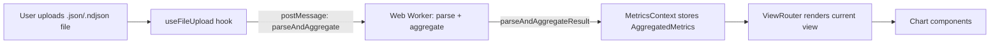
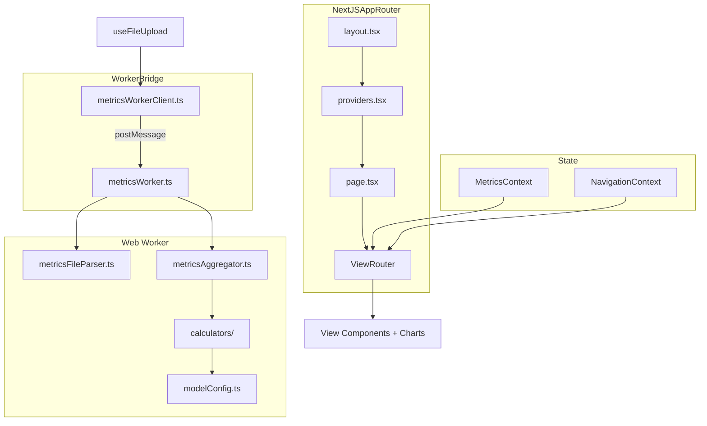

# GitHub Copilot User Level Metrics Viewer

Project overview: purpose, key design decisions, and data flow.

---

## 1. Purpose

A **client-side single-page analytics dashboard** for exploring **GitHub Copilot user-level metrics**. Designed for engineering leaders and admins who receive Copilot usage exports (JSON / NDJSON).

The app runs entirely in the browser — uploaded metrics files are parsed client-side and never sent to a backend.

Key analysis dimensions: **user**, **IDE**, **language**, **feature**, **model**, and **Premium Request Unit (PRU)** consumption.

---

## 2. Data Format

The input is a GitHub Copilot **User Level Metrics** export in `.ndjson` (newline-delimited JSON) or plain JSON array form. Each record is modeled by the `CopilotMetrics` type in `src/types/metrics.ts`.

Key facts about the input format:
- Each record represents one user's activity for one day
- Records contain nested breakdowns: `totals_by_ide`, `totals_by_feature`, `totals_by_language_feature`, `totals_by_language_model`, `totals_by_model_feature`
- Only the **new LOC schema** (`loc_added_sum`, `loc_deleted_sum`, `loc_suggested_*`) is supported — records with the deprecated `generated_loc_sum` / `accepted_loc_sum` fields are skipped

Static plugin version metadata (`public/data/vscode.json`, `public/data/jetbrains.json`) is used for contextual plugin version displays, not as primary input.

---

## 3. Architecture

Next.js App Router SPA, TypeScript, Tailwind CSS. All rendering is client-side.

### 3.1. Key Design Decisions

**Web Worker for parsing and aggregation.** All CPU-intensive work (file parsing, metrics aggregation) runs in a dedicated Web Worker (`src/workers/`). The worker is pre-bundled via esbuild into `public/workers/metricsWorker.js` as a self-contained IIFE — this is required for compatibility with Next.js static export (`output: 'export'`).

**Raw metrics never leave the worker.** The `parseAndAggregate` flow parses files and aggregates them into a compact `AggregatedMetrics` object entirely within the worker. Only this pre-aggregated result is transferred to the main thread. This significantly reduces memory footprint for large datasets.

**Two React contexts for state:**
- `MetricsContext` (`src/components/MetricsContext.tsx`) — stores the `AggregatedMetrics` result, loading/error state, and data actions
- `NavigationContext` (`src/state/NavigationContext.tsx`) — manages current view, selected user/model, and navigation actions

**All view components consume pre-aggregated data.** No component accesses raw `CopilotMetrics[]` directly. The `AggregatedMetrics` type (see `src/types/aggregatedMetrics.ts`) is the sole data contract between the worker and the UI.

### 3.2. Code Organization

| Directory | Purpose |
|---|---|
| `src/app/` | Next.js App Router entry points and providers |
| `src/components/` | View components, charts, layout, UI primitives |
| `src/components/charts/` | Chart.js visualizations (via react-chartjs-2) |
| `src/domain/` | Business logic: parser, aggregator, model config |
| `src/domain/calculators/` | Individual metric calculators (stats, engagement, PRU, impact, etc.) |
| `src/hooks/` | Reusable React hooks (file upload, sorting, search) |
| `src/workers/` | Web Worker entry point, client API, message types |
| `src/state/` | Navigation context |
| `src/types/` | TypeScript type definitions |
| `src/utils/` | Formatting and utility helpers |

### 3.3. Model Configuration

`src/domain/modelConfig.ts` contains a curated catalog of known LLM models with PRU multipliers and premium flags. Key exports: `getModelMultiplier()` and `isPremiumModel()`. Used by calculators to compute PRU costs and service value.

---

## 4. Data Flow

### 4.1. Upload and Parsing

1. `useFileUpload` validates file extension and sends files to the worker via `parseAndAggregateInWorker()`
2. The worker streams each file using `File.stream()` API, parses lines via `parseMetricsLine`, and applies string interning (`StringPool`) for memory efficiency
3. Records using deprecated LOC fields or missing required fields are skipped
4. The worker runs `aggregateMetrics()` on the parsed data and returns only the `AggregatedMetrics` result, enterprise name, and record count

### 4.2. Aggregation

`metricsAggregator.ts` orchestrates all calculators in `src/domain/calculators/` to produce the `AggregatedMetrics` object. This includes user summaries, daily time series,  language/IDE/model breakdowns, PRU analysis, feature adoption, and LOC impact by mode. See the calculator files for specifics.

### 4.3. Views

`ViewRouter` (`src/components/layout/ViewRouter.tsx`) maps the current `ViewMode` to the appropriate component. Views include: overview dashboard, users list, user details, languages, IDEs, Copilot impact, PRU usage, adoption, and model details.

Charts use **Chart.js** via **react-chartjs-2**, wrapped in a `ChartContainer` component for consistent styling.

---

## 5. Architecture Diagram

