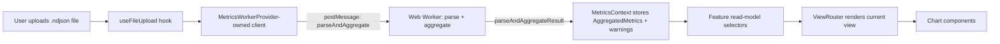
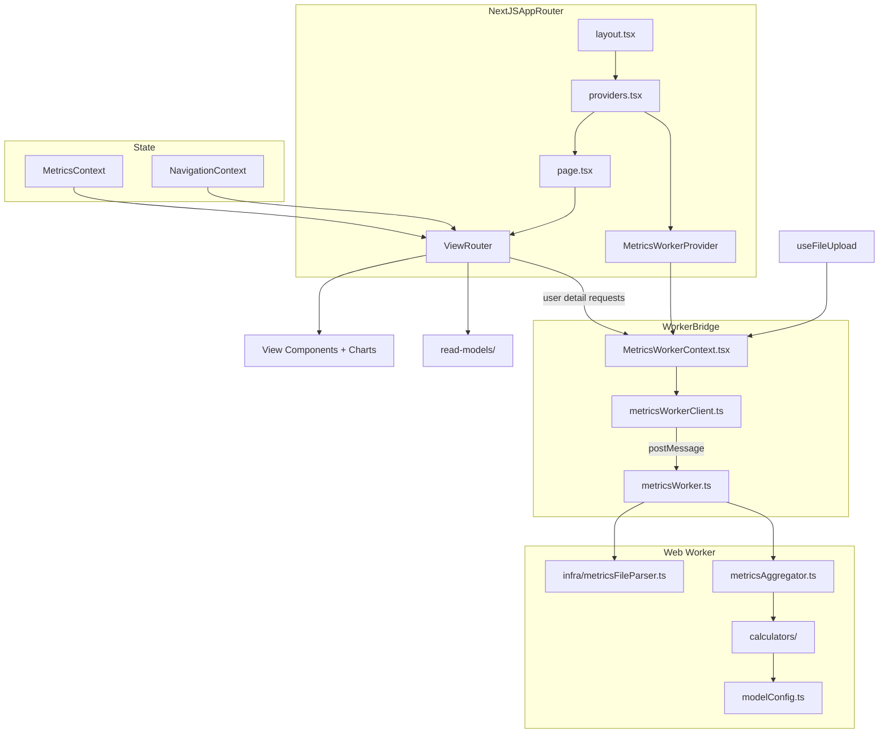

# GitHub Copilot User Level Metrics Viewer

Project overview: purpose, key design decisions, and data flow.

---

## 1. Purpose

A **client-side single-page analytics dashboard** for exploring **GitHub Copilot user-level metrics**. Designed for engineering leaders and admins who receive Copilot usage exports (NDJSON).

The app runs entirely in the browser — uploaded metrics files are parsed client-side and never sent to a backend.

Key analysis dimensions: **user**, **IDE**, **language**, **feature**, and **model** usage.

---

## 2. Data Format

The input is a GitHub Copilot **User Level Metrics** export in `.ndjson` (newline-delimited JSON) format. Each record is modeled by the `CopilotMetrics` type in `src/types/metrics.ts`.

Key facts about the input format:
- Each record represents one user's activity for one day
- Records contain nested breakdowns: `totals_by_ide`, `totals_by_feature`, `totals_by_language_feature`, `totals_by_language_model`, `totals_by_model_feature`
- Only the **new LOC schema** (`loc_added_sum`, `loc_deleted_sum`, `loc_suggested_*`) is supported — records with the deprecated `generated_loc_sum` / `accepted_loc_sum` fields are skipped

Static plugin version metadata (`public/data/vscode.json`, `public/data/jetbrains.json`) is used for contextual plugin version displays, not as primary input.

---

## 3. Architecture

Next.js App Router SPA, TypeScript, Tailwind CSS. All rendering is client-side.

### 3.1. Key Design Decisions

**Web Worker for parsing and aggregation.** All CPU-intensive work (file parsing, metrics aggregation) runs in a dedicated Web Worker (`src/workers/`). The worker is pre-bundled via esbuild into `public/workers/metricsWorker.js` as a self-contained IIFE — this is required for compatibility with Next.js static export (`output: 'export'`).

**Raw metrics never leave the worker.** The `parseAndAggregate` flow parses files and aggregates them into a compact `AggregatedMetrics` object entirely within the worker. Only this pre-aggregated result is transferred to the main thread. This significantly reduces memory footprint for large datasets.

**Two React contexts for state:**
- `MetricsContext` (`src/components/MetricsContext.tsx`) — stores the `AggregatedMetrics` result, loading/error/warning state, and data actions
- `NavigationContext` (`src/state/NavigationContext.tsx`) — manages current view, selected user/model, and navigation actions

**All view components consume pre-aggregated data.** No component accesses raw `CopilotMetrics[]` directly. The flat `AggregatedMetrics` worker/UI contract is declared in `src/types/aggregatedMetrics.ts`. Feature read-model selectors in `src/read-models/` insulate migrated UI paths from that flat payload; overview, executive summary, users, and user details consume only their typed projections. The worker also retains a compact user-detail accumulator so it can serve user details on demand without moving raw records onto the main thread.

### 3.2. Code Organization

| Directory | Purpose |
|---|---|
| `src/app/` | Next.js App Router entry points and providers |
| `src/components/` | View components, charts, layout, UI primitives |
| `src/components/charts/` | Chart.js visualizations (via react-chartjs-2) |
| `src/domain/` | Business logic: aggregator, model config, calculators |
| `src/infra/` | Streaming metrics file parser |
| `src/domain/calculators/` | Individual metric calculators (stats, engagement, model usage, impact, etc.) |
| `src/hooks/` | Reusable React hooks (file upload, sorting, search) |
| `src/workers/` | Web Worker entry point, client API, message types |
| `src/state/` | Navigation context |
| `src/read-models/` | Pure feature projections over the aggregate contract |
| `src/types/` | TypeScript type definitions |
| `src/utils/` | Formatting and utility helpers |

### 3.3. Model Configuration

`src/domain/modelConfig.ts` contains a curated catalog of known LLM models. Calculators use model helpers for normalization, known-model alias recognition, and explicit unknown/empty model detection.

---

## 4. Data Flow

```mermaid
flowchart LR
  A[User uploads .ndjson file] --> B[useFileUpload hook]
  B --> C[MetricsWorkerProvider-owned client]
  C -->|postMessage: parseAndAggregate| W[Web Worker: parse + aggregate]
  W -->|parseAndAggregateResult| D[MetricsContext stores AggregatedMetrics + warnings]
  D --> RM[Feature read-model selectors]
  RM --> E[ViewRouter renders current view]
  E --> F[Chart components]
```

### 4.1. Upload and Parsing

1. `useFileUpload` validates file extensions and requests parsing through the typed worker client exposed by `MetricsWorkerProvider`
2. The worker streams each file through `src/infra/metricsFileParser.ts` using the `File.stream()` API, parses lines via `parseMetricsLine`, and applies string interning (`StringPool`) for memory efficiency
3. Records using deprecated LOC fields or missing required fields are skipped
4. The worker runs `aggregateMetrics()` on the parsed data, retains the compact user-detail accumulator for on-demand requests, and returns the `AggregatedMetrics` result, enterprise name, record count, and any per-file parse errors (surfaced as a non-fatal warning in the UI when partial failures occur). Raw records remain off the main thread.
5. `MetricsWorkerProvider` is the application-level lifecycle owner. Its client creates the browser Worker lazily, correlates requests and progress responses, cancels pending work on reusable resets, and permanently disposes the Worker when the provider unmounts.

### 4.2. Aggregation

`metricsAggregator.ts` orchestrates all calculators in `src/domain/calculators/` to produce the flat `AggregatedMetrics` object declared in `src/types/aggregatedMetrics.ts`. This includes user summaries, daily time series, language/IDE/model breakdowns, model usage analysis, feature adoption, and LOC impact by mode. The worker payload remains flat; `src/read-models/` provides feature boundaries on the consuming side. See the calculator files for specifics.

### 4.3. Views

`ViewRouter` (`src/components/layout/ViewRouter.tsx`) maps the current `ViewMode` to the appropriate component. Migrated views receive typed read models rather than the full aggregate contract. Views include: overview dashboard, users list, user details, languages, IDEs, Copilot impact, model usage analysis, adoption, AI adoption phases, and model details.

Charts use **Chart.js** via **react-chartjs-2**, wrapped in a `ChartContainer` component for consistent styling.

---

## 5. Architecture Diagram

```mermaid
flowchart TB
	subgraph NextJSAppRouter
		direction TB
		L[layout.tsx] --> P[providers.tsx]
		P --> H[page.tsx]
		H --> VR[ViewRouter]
		P --> MWP[MetricsWorkerProvider]
	end

	subgraph State
		MC[MetricsContext]
		NC[NavigationContext]
	end

	subgraph WebWorker[Web Worker]
		MFP[infra/metricsFileParser.ts]
		MA[metricsAggregator.ts]
		CALC[calculators/]
		MConf[modelConfig.ts]
	end

	subgraph WorkerBridge
		MWC[MetricsWorkerContext.tsx]
		WC[metricsWorkerClient.ts]
		WT[metricsWorker.ts]
	end

	VR --> Views[View Components + Charts]
	VR --> RM[read-models/]

	MWP --> MWC
	MWC --> WC
	UFU[useFileUpload] --> MWC
	VR -->|user detail requests| MWC
	WC -->|postMessage| WT
	WT --> MFP
	WT --> MA
	MA --> CALC
	CALC --> MConf

	MC --> VR
	NC --> VR
```
