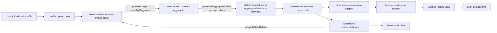
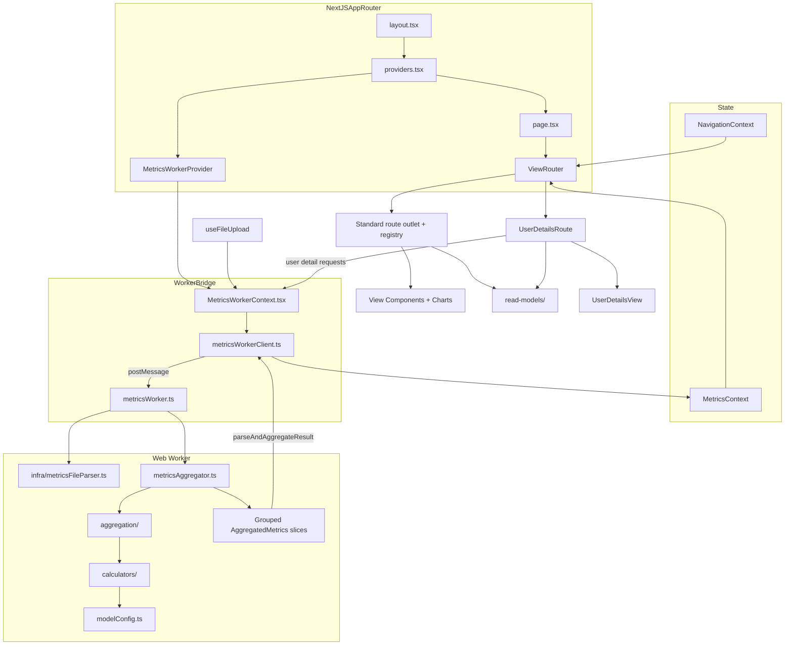

# GitHub Copilot User Level Metrics Viewer

Project overview: purpose, key design decisions, and data flow.

---

## 1. Purpose

A **client-side single-page analytics dashboard** for exploring **GitHub Copilot user-level metrics**. Designed for engineering leaders and admins who receive Copilot usage exports (NDJSON).

The app runs entirely in the browser — uploaded metrics files are parsed client-side and never sent to a backend.

Key analysis dimensions: **user**, **IDE**, **language**, **feature**, and **model** usage.

---

## 2. Data Format

The input is a GitHub Copilot **User Level Metrics** export in `.ndjson` (newline-delimited JSON) format. Each record is modeled by the `CopilotMetrics` type in `src/types/metrics.ts`.

Key facts about the input format:
- Each record represents one user's activity for one day
- Records contain nested breakdowns: `totals_by_ide`, `totals_by_feature`, `totals_by_language_feature`, `totals_by_language_model`, `totals_by_model_feature`
- Only the **new LOC schema** (`loc_added_sum`, `loc_deleted_sum`, `loc_suggested_*`) is supported — records with the deprecated `generated_loc_sum` / `accepted_loc_sum` fields are skipped

Static plugin version metadata (`public/data/vscode.json`, `public/data/jetbrains.json`) is used for contextual plugin version displays, not as primary input.

---

## 3. Architecture

Next.js App Router SPA, TypeScript, Tailwind CSS. All rendering is client-side.

### 3.1. Key Design Decisions

**Web Worker for parsing and aggregation.** All CPU-intensive work (file parsing, metrics aggregation) runs in a dedicated Web Worker (`src/workers/`). The worker is pre-bundled via esbuild into `public/workers/metricsWorker.js` as a self-contained IIFE — this is required for compatibility with Next.js static export (`output: 'export'`).

**Raw metrics never leave the worker.** The `parseAndAggregate` flow parses files and aggregates them into a compact, grouped `AggregatedMetrics` object entirely within the worker. Only this pre-aggregated result is transferred to the main thread. This significantly reduces memory footprint for large datasets.

**Two React contexts for state:**
- `MetricsContext` (`src/components/MetricsContext.tsx`) — stores the `AggregatedMetrics` result, loading/error/warning state, and data actions
- `NavigationContext` (`src/state/NavigationContext.tsx`) — manages current view, selected user/model, and navigation actions

**All view components consume pre-aggregated data.** No component accesses raw `CopilotMetrics[]` directly. The canonical `AggregatedMetrics` worker/UI contract is declared in `src/types/aggregatedMetrics.ts` and groups every aggregate under one owning domain slice. Feature read-model selectors in `src/read-models/` navigate only the slices they need; overview, executive summary, users, user details, Copilot adoption, AI adoption phases, Copilot impact, languages, clients, client versions, model details, CLI adoption, and AI credits retain their narrow runtime projections. Standard route adapters in `src/components/layout/routes/` own the selector and existing view for each non-user-details route, so only the selected route computes its projection. The specialized `UserDetailsRoute` owns user selection, on-demand worker requests, stale-result protection, redirects, recovery, and delivery of the user-details view model. The worker retains a compact user-detail accumulator so it can serve those requests without moving raw records onto the main thread.

### 3.2. Code Organization

| Directory | Purpose |
|---|---|
| `src/app/` | Next.js App Router entry points and providers |
| `src/components/` | View components, charts, layout, UI primitives |
| `src/components/layout/routes/` | Typed standard-route adapters/registry and specialized user-details route |
| `src/components/charts/` | Chart.js visualizations (via react-chartjs-2) |
| `src/domain/` | Business logic: aggregator, model config, calculators |
| `src/domain/aggregation/` | Concrete metric-family accumulator lifecycle orchestration |
| `src/infra/` | Streaming metrics file parser |
| `src/domain/calculators/` | Individual metric calculators (stats, engagement, model usage, impact, etc.) |
| `src/hooks/` | Reusable React hooks (file upload, sorting, search) |
| `src/workers/` | Web Worker entry point, client API, message types |
| `src/state/` | Navigation context |
| `src/read-models/` | Pure feature projections over the aggregate contract |
| `src/types/` | TypeScript type definitions |
| `src/utils/` | Formatting and utility helpers |

### 3.3. Model Configuration

`src/domain/modelConfig.ts` contains a curated catalog of known LLM models. Calculators use model helpers for normalization, known-model alias recognition, and explicit unknown/empty model detection.

### 3.4. Feature Read-Model Boundaries

The successful worker payload is one grouped `AggregatedMetrics` object. Each former root field has exactly one owner:

```text
AggregatedMetrics
├── overview  stats, engagementData, chatUsersData, chatRequestsData
├── users     userSummaries
├── adoption  featureAdoptionData, agentModeHeatmapData, adoption series
├── impact    agent, completion, edit, inline, ask, CLI, and joined impact
├── languages language stats, feature impact, generation and LOC series
├── clients   IDE stats/counts and plugin versions
├── models    daily model usage and model breakdown
├── cli       session, token, and adoption series
└── ai        adoption phases, usage distribution, and credits
```

Pure selectors under `src/read-models/` project stable nested references from those slices into unchanged UI contracts without copying, sorting, filtering, or mutation. Selectors may contain only existing deterministic, feature-specific scalar or date derivations, such as client CLI totals, the model-details auto total, CLI model chart dates, and the AI credits user total. Executive summary composes across `overview`, `impact`, and `adoption`; user-details routing preserves the complete grouped aggregate object as its dataset identity.

Established boundaries cover:
- overview and executive summary
- users and on-demand user details
- Copilot adoption
- AI adoption phases
- Copilot impact
- languages
- clients and client versions
- model details and CLI adoption
- AI credits

Phase 4 feature read-model boundaries, Phase 7 thin view routing, and Phase 8 grouped aggregate contract migration are complete. The typed standard-route registry delegates all non-user-details routes, while `UserDetailsRoute` owns the complete specialized lifecycle. `ViewRouter` retains only metrics-wide gates and top-level route selection. Phase 6 feature-view organization remains deferred.

---

## 4. Data Flow


```mermaid
flowchart LR
  A[User uploads .ndjson file] --> B[useFileUpload hook]
  B --> C[MetricsWorkerProvider-owned client]
  C -->|postMessage: parseAndAggregate| W[Web Worker: parse + aggregate]
  W -->|parseAndAggregateResult: grouped slices| D[MetricsContext stores AggregatedMetrics + warnings]
  D --> VR[ViewRouter resolves current route]
  VR --> SR[Selected standard route adapter]
  VR --> UR[Specialized UserDetailsRoute]
  SR --> RM[Feature read-model selector]
  RM --> E[Existing feature view]
  UR -->|computeUserDetails| C
  UR --> UDV[UserDetailsView]
  E --> F[Chart components]
```

### 4.1. Upload and Parsing

1. `useFileUpload` validates file extensions and requests parsing through the typed worker client exposed by `MetricsWorkerProvider`
2. The worker streams each file through `src/infra/metricsFileParser.ts` using the `File.stream()` API, parses lines via `parseMetricsLine`, and applies string interning (`StringPool`) for memory efficiency
3. Records using deprecated LOC fields or missing required fields are skipped
4. The worker runs `aggregateMetrics()` on the parsed data, retains the compact user-detail accumulator for on-demand requests, and returns the grouped `AggregatedMetrics` result, enterprise name, record count, and any per-file parse errors (surfaced as a non-fatal warning in the UI when partial failures occur). The request protocol and lifecycle are unchanged; raw records remain off the main thread.
5. `MetricsWorkerProvider` is the application-level lifecycle owner. Its client creates the browser Worker lazily, correlates requests and progress responses, cancels pending work on reusable resets, and permanently disposes the Worker when the provider unmounts.

### 4.2. Aggregation

`metricsAggregator.ts` retains the single explicit pass over raw records and coordinates concrete metric-family lifecycles in `src/domain/aggregation/` with calculators in `src/domain/calculators/`. Core stats, user summaries, user detail, language, model, client, CLI, engagement/adoption, impact, and AI orchestration each own accumulator creation, per-record consumption, and narrow finalization. The core-stats lifecycle owns first-record report metadata, filtered-record counting, and per-user usage signals while exposing its stats accumulator explicitly to the language, model, and client families for their dimension-specific contributions. The user-detail lifecycle returns the same compact calculator accumulator retained by the worker for on-demand requests.

The coordinator resolves the Copilot Cloud Agent compatibility signal exactly once per raw record and passes that boolean to core stats, user summaries, user detail, and engagement/adoption. CLI usage is accumulated once by the CLI family, including zero-filled dates. Its narrow, read-only daily-session dependency is consumed by engagement/adoption finalization so engagement, chat, and adoption retain CLI users and sessions without duplicating accumulation or exposing token internals. Model aggregation retains ownership of agent heatmap state through an explicit feature-signal entry point while the engagement/adoption and impact families independently consume the feature fields required by their calculators.

Phase 5 modular aggregation orchestration and Phase 8 grouped contract assembly are complete. The top-level coordinator deliberately retains only accumulator wiring, one raw-record loop, shared-signal resolution, narrow cross-family dependencies, finalization, and grouped assembly. Concrete family results map directly into `overview`, `users`, `adoption`, `impact`, `languages`, `clients`, `models`, `cli`, and `ai` without recomputation, compatibility aliases, or duplicate ownership. The worker still returns the compact user-detail accumulator separately for retained on-demand use.

### 4.3. Views

`ViewRouter` (`src/components/layout/ViewRouter.tsx`) is the thin top-level coordinator for metrics-wide upload, fatal-error, and loading gates. It selects either the typed standard-route outlet or the specialized `UserDetailsRoute`. Each standard adapter invokes its feature selector lazily and renders the existing view with a narrow shared route context. `UserDetailsRoute` consumes metrics, navigation, and worker contexts directly and owns selection/summary resolution, request invalidation and retry, effect-only redirects, stale-result rejection, cleanup, recoverable errors, and final `UserDetailsView` model delivery. This completes Phase 7 thin view routing; Phase 6 feature-view moves and decomposition remain deferred.

Charts use **Chart.js** via **react-chartjs-2**, wrapped in a `ChartContainer` component for consistent styling.

---

## 5. Architecture Diagram


```mermaid
flowchart TB
	subgraph NextJSAppRouter
		direction TB
		L[layout.tsx] --> P[providers.tsx]
		P --> H[page.tsx]
		H --> VR[ViewRouter]
		P --> MWP[MetricsWorkerProvider]
	end

	subgraph State
		MC[MetricsContext]
		NC[NavigationContext]
	end

	subgraph WebWorker[Web Worker]
		MFP[infra/metricsFileParser.ts]
		MA[metricsAggregator.ts]
		AGG[aggregation/]
		CALC[calculators/]
		MConf[modelConfig.ts]
		GAM[Grouped AggregatedMetrics slices]
	end

	subgraph WorkerBridge
		MWC[MetricsWorkerContext.tsx]
		WC[metricsWorkerClient.ts]
		WT[metricsWorker.ts]
	end

	VR --> SR[Standard route outlet + registry]
	SR --> Views[View Components + Charts]
	SR --> RM[read-models/]
	VR --> UD[UserDetailsRoute]
	UD --> UDV[UserDetailsView]
	UD --> RM

	MWP --> MWC
	MWC --> WC
	UFU[useFileUpload] --> MWC
	UD -->|user detail requests| MWC
	WC -->|postMessage| WT
	WT --> MFP
	WT --> MA
	MA --> AGG
	MA --> GAM
	AGG --> CALC
	CALC --> MConf
	GAM -->|parseAndAggregateResult| WC
	WC --> MC

	MC --> VR
	NC --> VR
```
